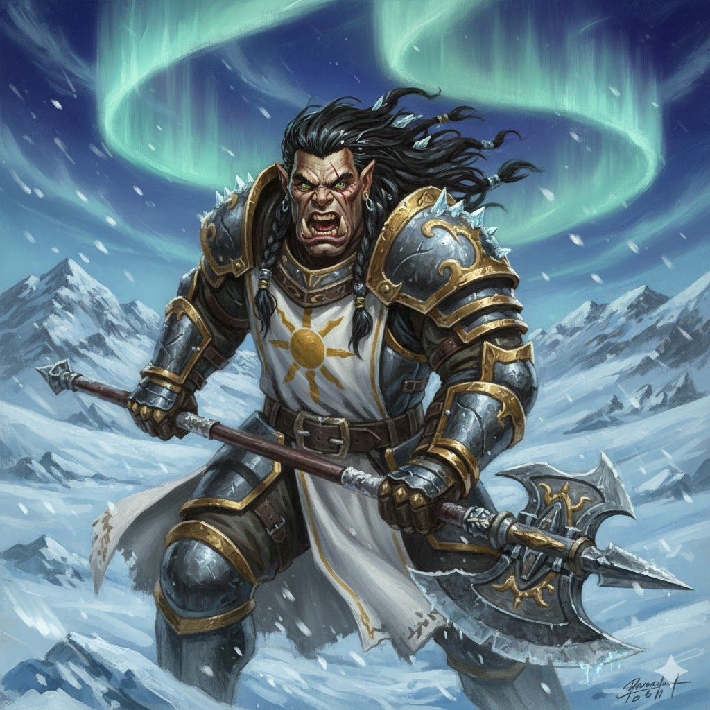

# Lord Pierce Brosnow - Level 6 Paladin (Oath of Vengeance)

**Player:** Patrick Donnelly

**Class:** Paladin (Oath of Vengeance) | **Level:** 6

**Race:** Orc | **Background:** Noble
**Experience Points:** Milestone | **Gold:** 3902.5 Gold Pieces | **Language:** Common, Orc

---

## 📊 Core Vitals

| Armor Class | Hit Points | Speed | Initiative | Proficiency Bonus | Spell Save Difficulty Class | Spell Attack Modifier |
|:--:|:--:|:--:|:--:|:--:|:--:|:--:|
| **18** | **52** | 30 feet (Fly 30 feet) | +0 | +3 | **14** | **+6** |

> **Armor Class Source:** Plate Armor (18)
> **Senses:** Darkvision 120 feet, Blind Fighting 10 feet, Passive Perception 12

## 🛡️ Ability Scores

| Ability | Score | Modifier | Save Modifier |
| :--- | :---: | :---: | :---: |
| **Strength** | **17** | +3 | +6 |
| **Dexterity** | 10 | +0 | +3 |
| **Constitution** | 14 | +2 | +5 |
| **Intelligence** | **19** | **+4** | **+7** |
| **Wisdom** | 8 | -1 | +5 |
| **Charisma** | **16** | +3 | **+9** |

*Note: Intelligence is set to 19 by the Headband of Intellect. All saving throws include the +3 bonus from Aura of Protection.*

## 🎭 Skills

| Skill | Modifier | Proficiency |
| :--- | :---: | :---: |
| **Acrobatics (Dexterity)** | +0 | |
| **Animal Handling (Wisdom)** | -1 | |
| **Arcana (Intelligence)** | **+4** | |
| **Athletics (Strength)** | **+6** | **✓** |
| **Deception (Charisma)** | **+6** | **✓** |
| **History (Intelligence)** | **+7** | **✓** |
| **Insight (Wisdom)** | **+2** | **✓** |
| **Intimidation (Charisma)** | **+6** | **✓** |
| **Investigation (Intelligence)** | **+4** | |
| **Medicine (Wisdom)** | -1 | |
| **Nature (Intelligence)** | **+4** | |
| **Perception (Wisdom)** | **+2** | **✓** |
| **Performance (Charisma)** | +3 | |
| **Persuasion (Charisma)** | **+6** | **✓** |
| **Religion (Intelligence)** | **+4** | |
| **Sleight of Hand (Dexterity)** | +0 | |
| **Stealth (Dexterity)** | +0 | |
| **Survival (Wisdom)** | -1 | |

## ⚔️ Combat Actions

### Weapon Attacks
| Weapon | Attack Bonus | Damage | Notes |
| :--- | :---: | :--- | :--- |
| **+1 Pike** | **+7** | **1d10 + 4** (Piercing) | Heavy, Reach (10 feet), Two-Handed, Push (10 feet), Magical |

> **Extra Attack:** You can attack twice, instead of once, whenever you take the Attack action on your turn.
> **House Rule (Flanking):** +2 to hit while flanking.
> **House Rule (Skill Crits):** Beat Difficulty Class by 10 for critical success.

### ⚡ Bonus Actions
* **Blessing of Lathander:** Choose one creature you damaged this turn. It takes 6 Radiant damage (twice your Proficiency Bonus). You may simultaneously "Spot a Foe" with Advantage. Only one blessing effect active at a time.
* **Vow of Enmity (Channel Divinity):** Advantage on attack rolls against one creature (10 feet range) for 1 minute.
* **Divine Smite (Spell):** Expend a spell slot immediately after hitting to deal 2d8 Radiant damage (+1d8 per slot level above 1st). +1d8 if target is Fiend/Undead.
* **Adrenaline Rush (Orc Trait):** Dash action + Gain 2 Temporary Hit Points. (Proficiency Bonus uses per Long Rest).
* **Lay on Hands:** Heal creature in touch range. Pool: **30 Hit Points**.
* **Potion:** Drink a potion.
* **Spot a Foe:** Perception check vs Stealth (You have Advantage on this via Blessing of Lathander).
* **Shout Instruction:** Issue 5-word instruction to allies.
* **Monster Knowledge:** Skill check (Difficulty Class 10 + ½ Challenge Rating) to recall stats.

### ↩️ Reactions
* **Sentinel Attack:** Melee weapon attack when a creature within 5 feet makes an attack against a target other than you.
* **Opportunity Attack:** Melee attack when enemy leaves reach (Sentinel: Disengage does not prevent this).
* **Grab a Handhold:** Dexterity or Strength saving throw to stop forced movement/fall.

---

## ✨ Spells
**Slots:** 4x 1st Level | 2x 2nd Level

### Cantrips (At Will)
-   **Guidance:** Add 1d4 to one ability check (Touch).
-   **Toll the Dead:** 1d8 Necrotic (1d12 if target is damaged) (Wisdom Saving Throw).

### 1st Level (Prepared: 4 + Oath Spells)
-   **[Oath] Bane:** (Concentration) 3 targets, subtract 1d4 from Attack/Save.
-   **[Oath] Hunter's Mark:** +1d6 Force damage on hit. **House Rule:** 1 minute duration, **NO Concentration**.
-   **Bless:** (Concentration) 3 targets, add +1d4 to Attack/Save.
-   **Cure Wounds:** Heal 2d8 + 3 Charisma Modifier (Touch).
-   **Shield of Faith:** (Concentration) +2 Armor Class (Bonus Action).

### 2nd Level (Prepared: Oath Spells)
-   **[Oath] Hold Person:** (Concentration) Paralyze one humanoid that you can see within 60 feet (Wisdom Saving Throw).
-   **[Oath] Misty Step:** (Bonus Action) Teleport up to 30 feet to an unoccupied space that you can see.

---

## 🧬 Features & Traits

### Supernatural Gifts
-   **Blessing of Lathander:** The Morninglord curses the unclean with the light of dawn. As a Bonus Action, choose one creature you damaged this turn. It takes Radiant damage equal to twice your Proficiency Bonus. Your Spot a Foe Bonus Actions have Advantage. You may Spot a Foe. Only one blessing at a time.

### Feats
-   **Sentinel (Level 4):**
    -   **Attribute Boost:** Increased Strength by 1.
    -   When you hit a creature with an opportunity attack, the creature's speed becomes 0 for the rest of the turn.
    -   Creatures provoke opportunity attacks from you even if they take the Disengage action before leaving your reach.
    -   When a creature within 5 feet of you makes an attack against a target other than you (and that target doesn't have this feat), you can use your reaction to make a melee weapon attack against the attacking creature.

### Paladin Class
-   **Divine Health:** Immune to disease.
-   **Lay on Hands:** Pool of 30 Hit Points. Cleanses poison (Costs 5 Hit Points).
-   **Fighting Style (Blind Fighting):** You have Blindsight with a range of 10 feet.
-   **Extra Attack:** You can attack twice, instead of once, whenever you take the Attack action on your turn.
-   **Aura of Protection:** Whenever you or a friendly creature within 10 feet of you must make a saving throw, the creature gains a +3 bonus to the saving throw (equal to your Charisma modifier). You must be conscious to grant this bonus.

### Oath of Vengeance (Subclass)
-   **Channel Divinity (1 per Short Rest):**
    -   *Vow of Enmity:* Advantage on attack rolls vs target.
    -   *Abjure Enemy:* Wisdom Saving Throw. Frightened & Speed 0 (or Speed halved on save). Undead/Fiends have Disadvantage.

### Orc Species
-   **Adrenaline Rush:** Bonus Action Dash.
-   **Relentless Endurance:** When reduced to 0 Hit Points but not killed, drop to 1 Hit Point instead (1 per Long Rest).

---

## 🎒 Inventory & Equipment

**Current Gold:** 3902.5 Gold Pieces

### 🧪 Consumable Slots (Tier 2 Limit: 10 per Session)
1. **Potion of Healing** (2d4+2)
2. **Potion of Healing** (2d4+2)
3. **Potion of Cold Resistance**: Resistance to Cold damage for 1 hour.
4. **Potion of Animal Friendship**: (Action) Animal must succeed Difficulty Class 13 Wisdom save or be Charmed for 1 hour.
5. **Scroll of Lesser Restoration**: (Action) Touch a creature to end one condition: Blinded, Deafened, Paralyzed, or Poisoned.
6. **Potion of Resistance (Psychic)**: Resistance to Psychic damage for 1 hour.
7. **Potion of Resistance (Psychic)**: Resistance to Psychic damage for 1 hour.

### Magic Items (Tier 2 Limit: 3 Uncommon+ per Session)
| Item | Rarity | Effect |
| :--- | :--- | :--- |
| **Winged Boots** | Uncommon | Grants a flying speed equal to your walking speed for up to 4 hours. |
| **Headband of Intellect** | Uncommon | Sets Intelligence score to 19. |
| **+1 Pike** | Uncommon | +1 bonus to attack and damage rolls. |
| **Boots of False Tracks** | Common | Change footprints (Polar Bear). |
| **Ersatz Eye** | Common | Artificial eye. |
| **Smoldering Armor** | Common | Cosmetic smoke. |
| **Unbreakable Arrow** | Common | Cannot break. |

### Gear (Stored / Unequipped)
-   *Uncommon Magic Item:* **Enspelled Holy Symbol** (Casts Healing Word).
-   *Uncommon Magic Item:* **Boots of the Winterland** (Cold Resist, ignore ice terrain).
-   *Uncommon Magic Item:* **Staff of the Adder** (Requires Cleric/Druid/Warlock).
-   *Stored Potions:* 1x Potion of Healing, 4x Potion of Cold Resistance.
-   Plate Armor (Armor Class 18)
-   Splint Armor (Stored)
-   Priest's Pack
-   Holy Symbol
-   Dice, Fine Clothes, Perfume
-   1 Sled
-   2 Sled Dogs

---

## 📖 APPENDIX: TACTICAL GUIDE

### 🎯 Scenario A: The Boss Killer (Single Strong Enemy)
*Goal: Maximize single-target damage and accuracy.*

* **Preferred Action:** **Attack** with +1 Pike (Reach 10 feet). Thanks to Extra Attack, you swing twice! Use your **Winged Boots** to fly directly over the frontline and engage the boss (especially Mind Flayers) while avoiding ground hazards.
* **Preferred Bonus Action 1:** **Vow of Enmity** (Channel Divinity) for Advantage.
* **Preferred Bonus Action 2 (Via Move Downgrade):** **Blessing of Lathander** to deal an automatic 6 Radiant damage after hitting, and getting a free Perception check with Advantage to spot any hidden minions.
* **Sentinel Reaction:** If the Boss attacks an ally within 5 feet of you, you get a free reaction attack. This is an excellent opportunity to trigger **Divine Smite** off-turn.
* **Key Spells:**
    * **Hunter's Mark (Bonus Action):** Cast this immediately. *Benefit:* Adds +1d6 damage per hit. **Note:** Due to House Rules, this does *not* require Concentration, allowing you to stack it with Bless.
    * **Divine Smite (Bonus Action):** Use after you land a critical hit or when you need burst damage.
    * **Shield of Faith (Bonus Action):** If the boss hits hard, boost your Armor Class to 20.

### 🛡️ Scenario B: The Party Leader (Buff & Support)
*Goal: Improve ally accuracy and keep them alive.*

* **Preferred Action:** **Cast Bless**.
    * *Effect:* You and 2 allies add +1d4 to Attacks and Saving Throws. This stacks with your Aura of Protection for massive defensive capabilities. Stay hovering nearby allies to ensure they remain within your Aura.
* **Preferred Bonus Action:** **Shout Instruction** or **Lay on Hands**.
* **Sentinel Defense:** Position yourself adjacent to squishy allies (Wizard/Rogue). If an enemy attacks them, **Sentinel** grants you a retaliatory strike, punishing the enemy for ignoring you.
* **Key Spells:**
    * **Bless (Action):** The best mathematically defensive and offensive buff for the group.
    * **Cure Wounds (Action):** Use only if an ally is critical and you are next to them; heals 2d8+3. *Note: With the Enspelled Holy Symbol stored, you must rely on this action or Lay on Hands for healing.*

### 🌪️ Scenario C: Crowd Control (Many Weak Enemies)
*Goal: Debuff enemies and manage the battlefield.*

* **Preferred Action:** **Cast Bane** or **Attack** twice to thin the horde.
    * *Effect:* 3 Enemies take -1d4 penalty to Attacks and Saves. Good against mobs with low Charisma.
* **Preferred Bonus Action:** **Abjure Enemy** (Channel Divinity).
    * *Effect:* Frightens one enemy and reduces their speed to 0. Great for stopping a "runner" or a brute trying to reach your wizard.
* **Sentinel Lockdown:** If an enemy tries to run past you to get to your backline, your Opportunity Attack reduces their speed to **0** for the rest of the turn, effectively rooting them in place. Use your aerial mobility to position yourself directly in choke points.
* **Key Spells:**
    * **Bane (Action):** Makes enemies miss more often.
    * **Toll the Dead (Action):** Use against enemies with High Armor Class or at range. Deals 1d12 Necrotic damage if they are injured.

---

## 🌍 APPENDIX: SOCIAL & EXPLORATION ACTIONS

### 🗣️ Social Interaction
* **Persuade (Persuasion +6):** Influence a creature with tact, social graces, or good nature.
* **Deceive (Deception +6):** Fast-talk a guard, wear a disguise, or maintain a straight face while lying.
* **Threaten (Intimidation +6):** Influence someone through overt threats, hostility, or physical presence.
* **Sense Motive (Insight +2):** Determine a creature's true intentions or detect if they are being untruthful.

### 🕵️ Investigation & Knowledge
* **Spot (Perception +2):** Use your senses to notice hidden details, hear faint noises, or detect an ambush.
* **Historical Lore (History +7):** Recall information about noble families, ancient kingdoms, or past wars.
* **Noble Standing (Feature):** As a **Noble**, you can secure an audience with local nobles and people assume you have the right to be where you are.

### 🧗 Physicality & Utility
* **Power Through (Athletics +6):** Climb difficult surfaces, jump long distances, or swim through rough water. With Winged Boots, you can simply bypass most physical obstacles entirely.
* **Animal Handling (-1):** Calm a domesticated animal or intuit an animal’s intentions.
* **Stealth (+0):** Move quietly or hide from view (Note: You have Disadvantage on these checks while wearing Plate Armor).

---

## 📝 Change Log (Inventory Update & Winged Boots)
* **Equipment Purchased:** Winged Boots (-400 Gold Pieces), +1 Pike (-400 Gold Pieces), Headband of Intellect (-400 Gold Pieces), Plate Armor (-1,500 Gold Pieces).
* **Equipment Stored:** Enspelled Holy Symbol. Lost *Healing Word* Bonus Action.
* **Financials:** Remaining Gold decreased to 3902.5 Gold Pieces.
* **Vitals Updated:** Armor Class increased to 18 (Plate). Added Flying Speed of 30 feet.
* **Attacks Updated:** Pike Attack Bonus increased to +7, Damage increased to 1d10+4.
* **Attributes Updated:** Intelligence set to 19 (+4 modifier). Intelligence Saving Throw increased to +7. Intelligence-based skills updated.
* **Tactical Guide Updated:** Incorporated Winged Boots mobility across all scenarios and removed *Healing Word* references.

## 📝 Change Log (Blessing of Lathander Update)
* **Features Added:** Blessing of Lathander. Added to features list and Bonus Actions. 
* **Tactical Guide:** Updated "Scenario A: The Boss Killer" to include using the Move action downgrade house rule to apply the Blessing of Lathander alongside other bonus actions.

## 📝 Change Log (Level 4 → 6)
* **Level:** Increased to 6.
* **Hit Points:** Increased +16 (New Max: 52).
* **Proficiency Bonus:** Increased from +2 to +3. Updated skills, attacks, and Difficulty Classes.
* **Features Added:** Extra Attack (Level 5), Aura of Protection (Level 6).
* **Saving Throws:** Updated all saving throws to include the +3 bonus from Aura of Protection.
* **Spells:** Gained two 2nd-Level spell slots. Added Oath Spells (*Hold Person*, *Misty Step*).
* **Lay on Hands:** Pool increased to 30 Hit Points.
* **Financials:**
    * Added Missed Session Rewards: +500 Gold Pieces (Tier 1) and +5,000 Gold Pieces (Tier 2).
    * Purchased 2x Potion of Resistance (Psychic) (-400 Gold Pieces).
    * New Total: 6602.5 Gold Pieces.
* **Inventory Config:** Added 2x Potion of Resistance (Psychic) to Consumables. Updated carry limits for Tier 2.

## 📝 Change Log (Feb 2026 Updates)
### Feb 25 2026
* **Financials**: Added +475 Gold Pieces (New Total: 1502.5 Gold Pieces).
* **Mechanics**: Updated *Cure Wounds* and *Healing Word* descriptions to specify the Charisma Modifier value (+3).

### Feb 11 2026
* **Financials:** Added +500 Gold Pieces from Feb 11 session (New Total: 1027.5 Gold Pieces).
* **Tactical Guide:** Updated all scenarios to include **Sentinel** feat strategies (Reaction attacks, defensive positioning, and speed reduction).

## 📝 Change Log (Level 3 → 4)
* **Feat:** Selected **Sentinel** (2024 Version).
* **Attribute Boost:** Strength increased from 16 to 17 (+1 from Sentinel).
* **Inventory Config:**
    * Equipped Consumables: 2x Potion of Healing, 1x Potion of Cold Resistance, 1x Potion of Animal Friendship, 1x Scroll of Lesser Restoration.
    * Stored (Unequipped): Boots of the Winterland, Staff of the Adder, 1x Potion of Healing, 4x Potion of Cold Resistance.
* **Level:** Increased to 4.
* **Hit Points:** Increased +8 (New Max: 36).
* **Features:** Lay on Hands pool increased to 20.
* **Financials:**
    * Added Tier 1 Reward (+500 Gold Pieces).
    * Purchased 5x Potion of Cold Resistance (-50 Gold Pieces).
    * Purchased 1x Scroll of Lesser Restoration (-80 Gold Pieces).

## 📝 Change Log (Level 2 → 3)
* **Hit Points:** Increased +8 (New Max: 28).
* **Spell Slots:** Increased to 3.
* **Subclass:** Selected **Oath of Vengeance**.
* **Features:** Added Divine Health, Channel Divinity, Oath Spells.
* **Financials:**
    - Sold old Chain Mail (+37.5 Gold Pieces).
    - Purchased Potion of Animal Friendship (-100 Gold Pieces).
    - Purchased Lesser Restoration Spell Scroll (-80 Gold Pieces).
    - Splint Armor (-200 Gold Pieces).
    - Enspelled Symbol (-400 Gold Pieces).
    - 3x Potions (-150 Gold Pieces).
    - 2 dogs (-50 Gold Pieces)

---

## 🗒️LLM TODO

- 

## Session Notes

### 2026 Apr 08
- add snowflake

### 2026 Feb 25
- Start session with Heroic Inspiration.
- Red Wizard Dazann burned. 
- Fireball scroll or bag of tricks from Captain Imdra Arlagath.
- Wet trout inn. N'metra dragonborn. Cython tiefling ferryman coiling rope. 
  + song over the lake, cython heariing it
- level of exhaustion (-2 to all rolls)
- use potion of frost resistance at ice giant cave
- add 475g

### 2026 Feb 11
- Hunters Mark; d20 -> 18 + 5 ; +5 dmg + 3 + 2 (hunters mark)
- 11 dmg
- used 20 lay-on hands
- 5 piercing
- +500 gp

### 2026 Jan 29
- Used Lay on Hands
- Used Scroll of Lesser Restoration
- Used Healing Word
- take 7 dmg, 14 dmg, +10 heal
- used divine smite
- add boots of the winterland
- staff of the adder
- +500gp
- level 4
